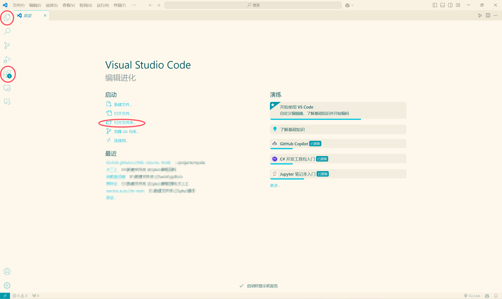

## motivation

常用的markdown编辑软件包括 **Typora, Vscode, Zettlr** 等. 其中 Typora 收费, 而cser 绝大多数代码都在 Vscode 中完成, 因此本教程是基于 Vscode 编写 md. 也可以用 notion 等笔记软件, 它们甚至可以将产出直接同步至个人主页, 但我始终认为 Vscode 作为综合性的 IDE (而非单独的笔记软件) 可以更自由更定制化, 自然配置和编写的难度也更高. 

当然这些选择对于书面语言的刚入门者来说影响不大, 可以熟练了再换. 

## 环境配置
首先你需要 [vscode](https://code.visualstudio.com/download), 并学会使用命令行和配置系统环境变量, 如果你还不会, 请善用搜索, 这个非常简单

然后打开 vscode 并注意下图的三个红圈, 资源管理器, 扩展, 打开文件夹

先点扩展

## 基础语法

## 进阶专题
### markdown & html
### markdown & python
### markdown 主题

