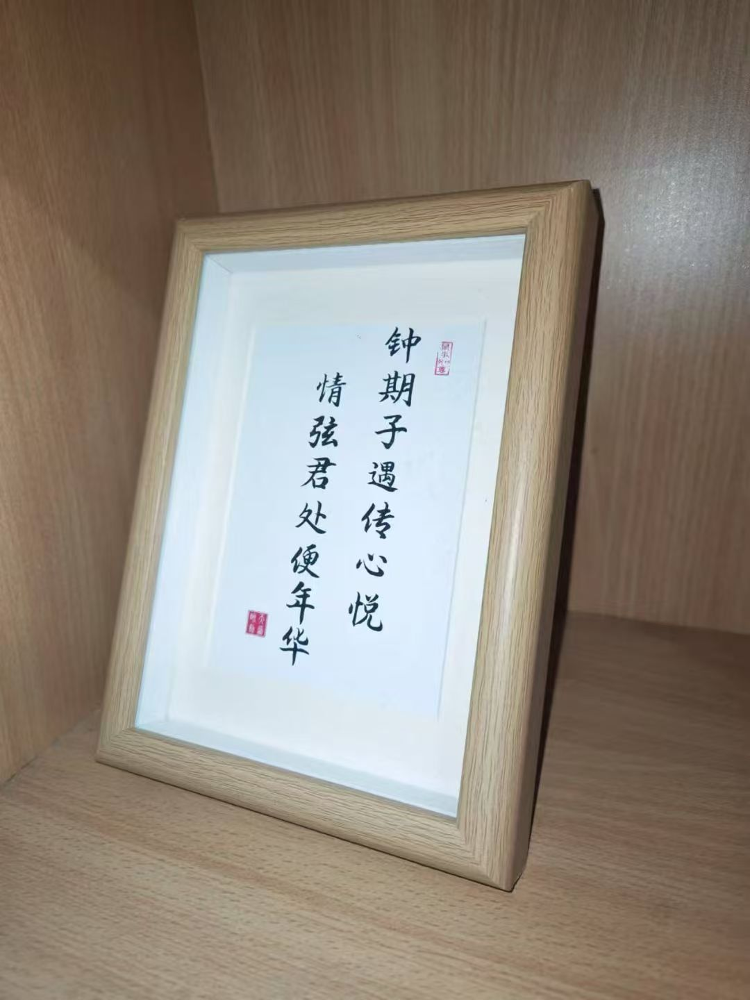

<html lang="zh">
<head>
    <meta charset="UTF-8">
    <meta name="viewport" content="width=device-width, initial-scale=1.0">
    <title>对联 *2</title>
    
</head>

    <h2>对联*2</h2>
    <!-- 第一阙 -->
    

        
钟期子遇传心悦, 
 
        
情弦君处便年华. 

    

    <!-- 第二阙 -->
    

        
将风未雨坐明堂, 
 
        
放眼时夏皆卷王. 

    

    
 
        
 甲辰年仲冬

    

<!-- 注释区域 -->

    

        <h4>甲辰年(2024.12.1)注</h4>
        
 这两对我都不会凑完整的诗, 因为会送给悦华. 这一页会在12.4日(她的阴历生日)我向她正式表白后加入网站. 

        
 第一联是藏头藏尾, 我们呢, 像恋人, 像道友, 像伯牙子期. 这是否是精神上的一见钟情? 她说这是倾盖如故, 白首如新. 我问她想看我写的诗吗. 这算是第一次互相试探吧, 也是我在网站上开始转录我笔记上的诗的缘由... 直到一个小误会让双方都觉得不必演了, 才有了这么一个约定好的"正式告白". 我想双向奔赴总是幸福欢乐的, 即便互相玩玩套路钓一钓鱼也很有意思, 但终究是质朴无华的表达才动人心弦.

        

  

        
 第二联因为是我们都很爱卷哈哈哈×, 熟络以后每天早上都要卷起床, 两人都换了个精气神, 也算是志趣相投. 这句应该是我写于三年前, 彼时豪气干云, 从未想过会送给未来的恋人.

        <h4>甲辰年(2024.1.13)注</h4>
        
我们已经分手, 此生再无交集, 但文字是好的, 就让它留在这里吧

